## 6. Interface do sistema

Esta seção apresenta as diversas interfaces (telas) que compõem o software Barbear.

## 6.1. Tela principal do sistema

A tela de página inicial apresenta opções para os diferentes tipos de usuários usarem o software. Ele pode logar no sistema ou acessar a tela de cadastro respectivo a seu tipo de usuário (cliente ou barbearia). Também há nessa tela algumas informações sobre a motivação da criação do software Barbear e algumas avaliações feitas por clientes.

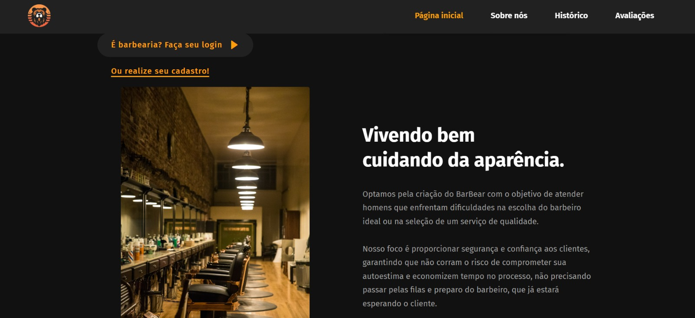

## 6.2. Telas do processo 1: Gerenciamento de serviços

Na tela a seguir, a barbearia pode consultar os serviços que ela cadastrou. Ao clicar em cadastrar novo serviço, a página é redirecionada para a página de cadastro de serviço e, ao clicar em alterar serviço, ela é redirecionada para a página de alteração do serviço. Ao clicar em excluir serviço, ele é excluído automaticamente.

Nesta tela, a barbearia pode cadastrar um novo serviço.

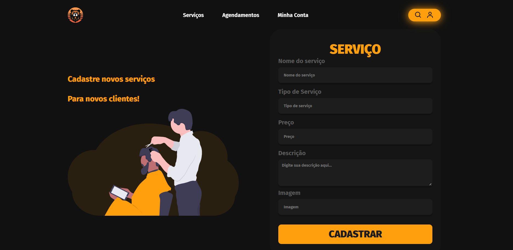

Na seguinte tela, a barbearia pode alterar os dados de um serviço já cadastrado.

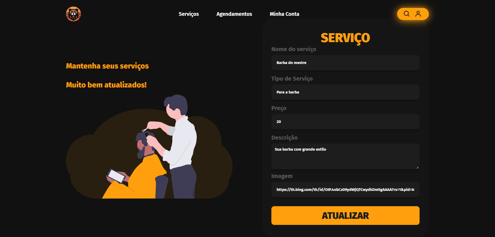

## 6.3. Telas do processo 2: Avaliação de Barbearias

Nesta tela, o cliente pode selecionar o agendamento que deseja avaliar.

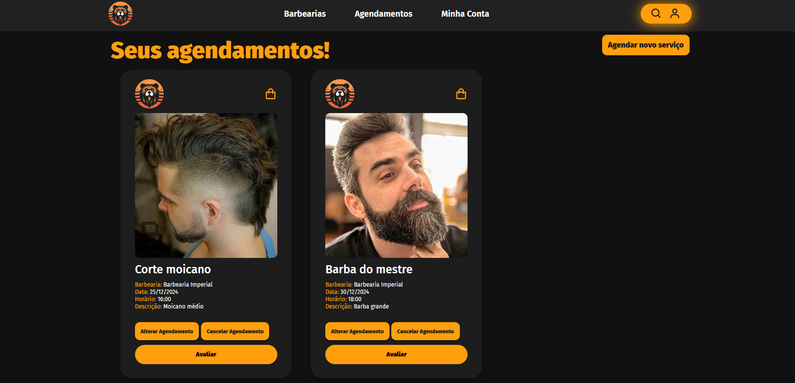

Nesta tela, aparece o agendamento que o cliente selecionou para avaliar. Quando ele clica no botão de avaliar, é exibido um pop-up para que ele realize a avaliação.

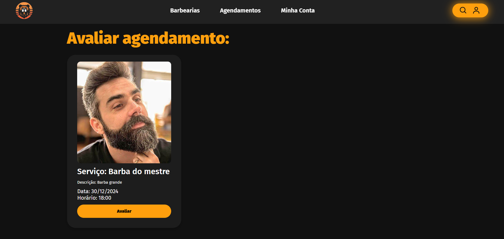

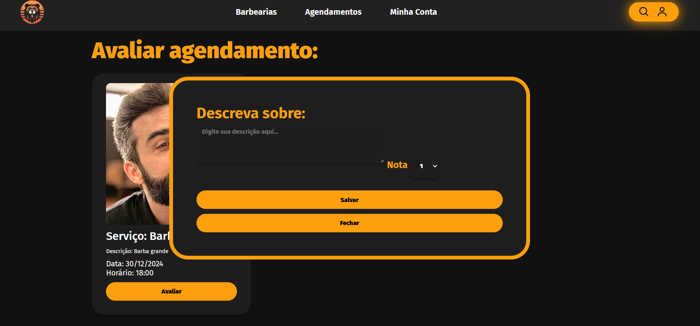

## 6.4. Telas do processo 3: Agendamento

A tela de Exibir Agendamentos é onde o cliente consegue visualizar os agendamentos já realizados por ele. Nesta tela, também já se inclui a possibilidade do cliente cancelar aquele agendamento, se necessário.

A tela de Cadastro de agendamento é onde o cliente pode, ao selecionar anteriormente um serviço de alguma barbearia, realizar um agendamento.

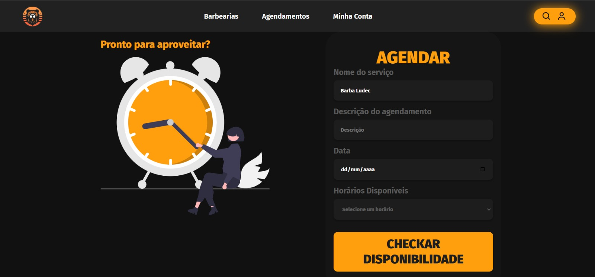

A tela de Alterar agendamento possibilita o cliente alterar dados de um agendamento específico.

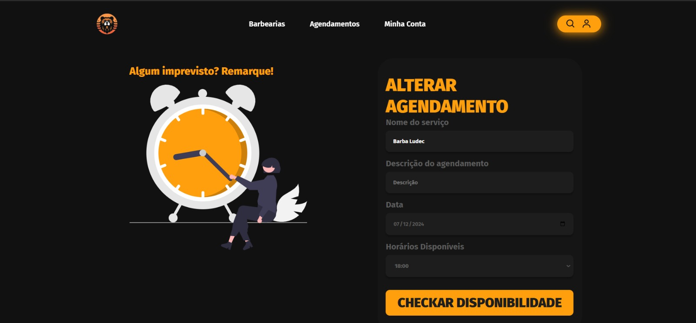

E ainda, a barbearia pode confirmar os agendamentos feitos pelos clientes. Nesta tela, na parte superior, aparecem os agendamentos que ainda precisam serem confirmados por ela, podendo também serem rejeitados, e, na parte inferior, aparecem os agendamentos já confirmados.

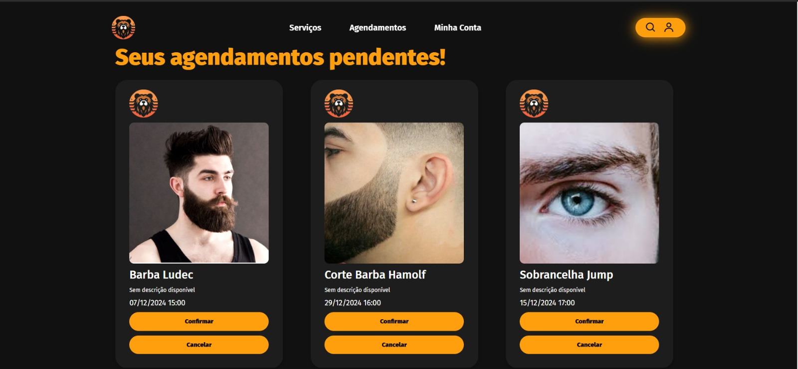

## 6.5. Telas do processo 4: Gerenciamento de Barbearia

A tela de login da barbearia é essencial para que o sistema identifique qual barbearia está logada.

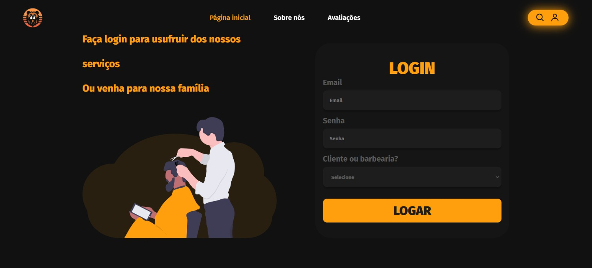

Caso a barbearia ainda não tenha se cadastrado na plataforma, ela pode fazer isso por meio da seguinte tela de cadastro.

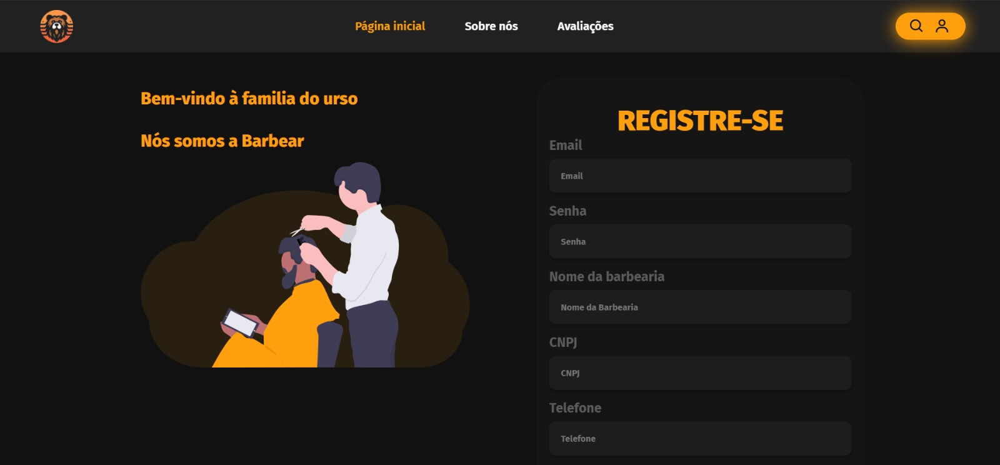

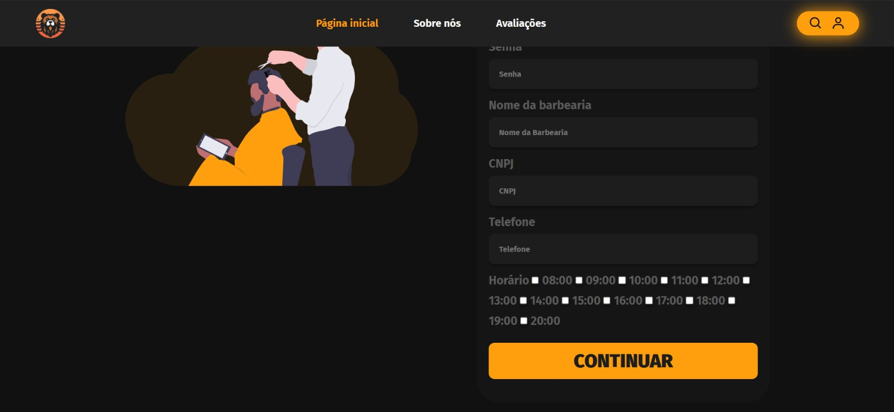

A barbearia pode consultar os seus dados cadastrados ou realizar outras ações por meio da tela denominada como "Minha Conta".

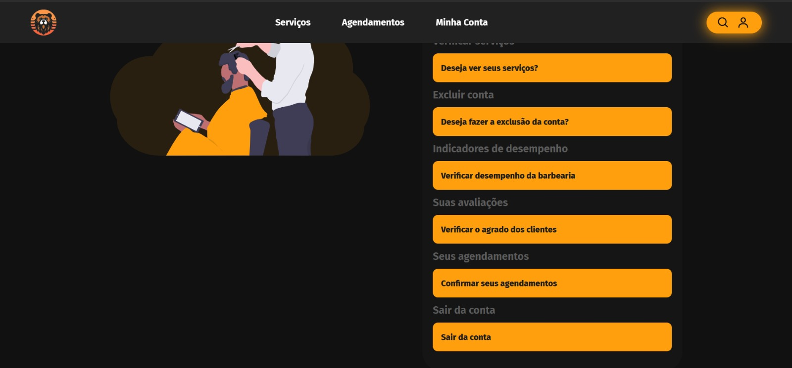

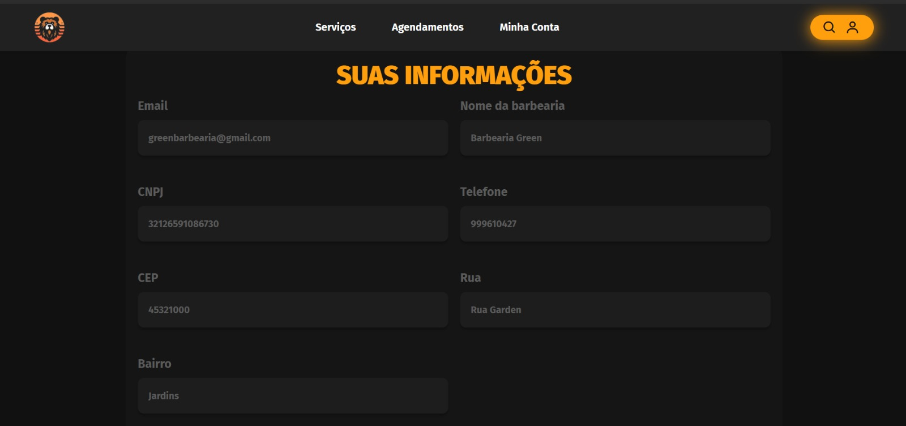

Caso tenha necessidade, a barbearia pode alterar os seus dados cadastrados.

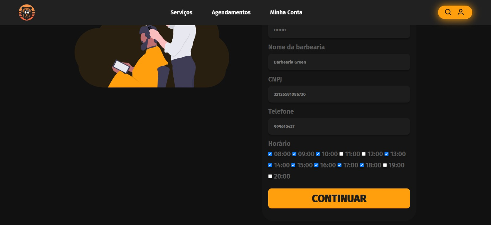

E também, ela consegue verifcar as avaliações feitas pelos clientes na seção de "Suas avaliações".

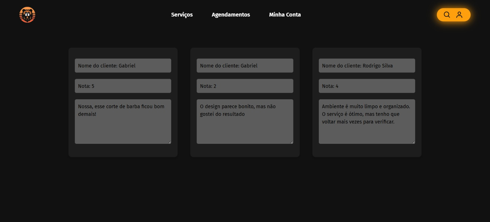

Se quiser, a barbearia pode excluir a sua conta.

## 6.6. Telas do processo 5: Gerenciamento de clientes

A tela de login do cliente é essencial para que o sistema identifique qual cliente está logado.

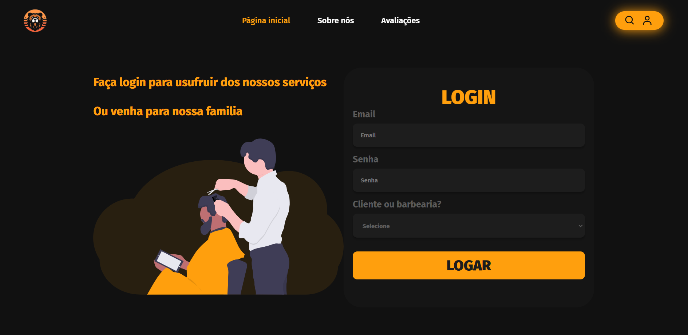

Caso o cliente ainda não tenha se cadastrado na plataforma, ele pode fazer isso por meio da seguinte tela de cadastro.

O cliente pode consultar os seus dados cadastrados ou realizar outras ações por meio da tela denominada como "Minha Conta".

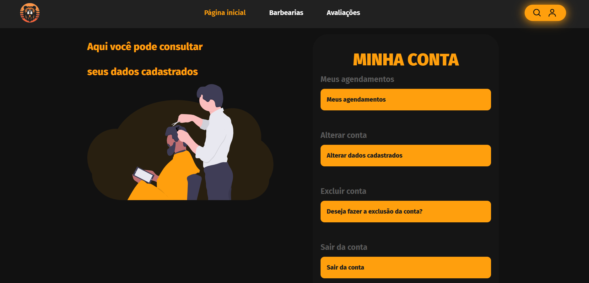

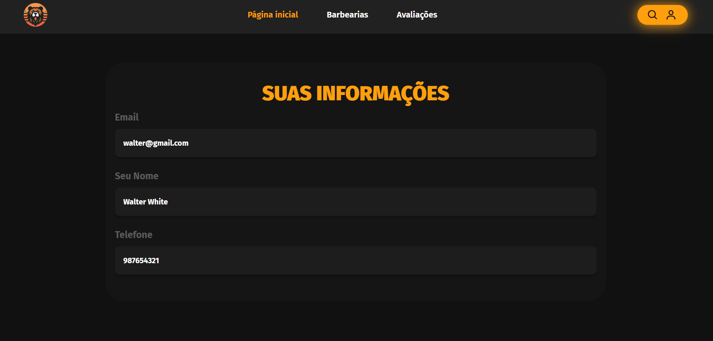

Caso tenha necessidade, o cliente pode alterar os seus dados cadastrados.

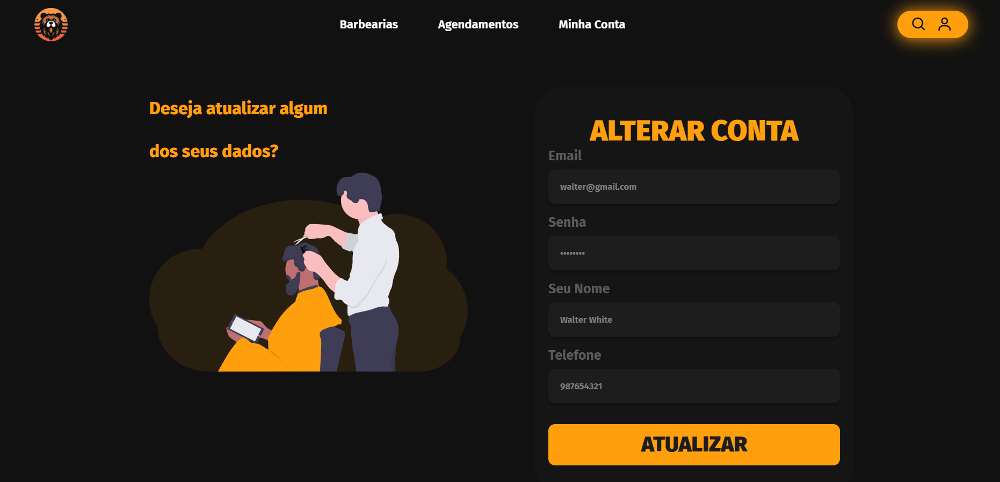

Caso queira, o cliente pode excluir a sua conta.

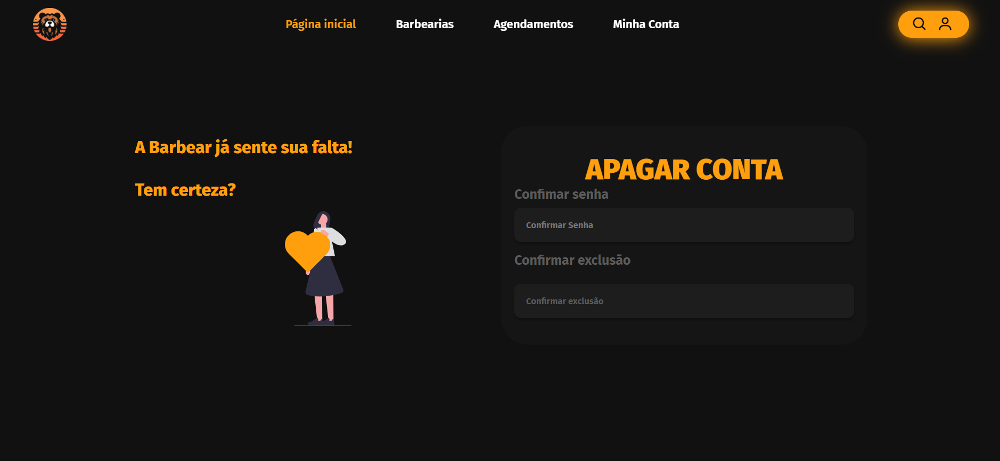

## 6.7. Tela de Indicadores de desempenho

A tela de Indicadores de desempenho mostra os dados quantitativos da respectiva barbearia logada.

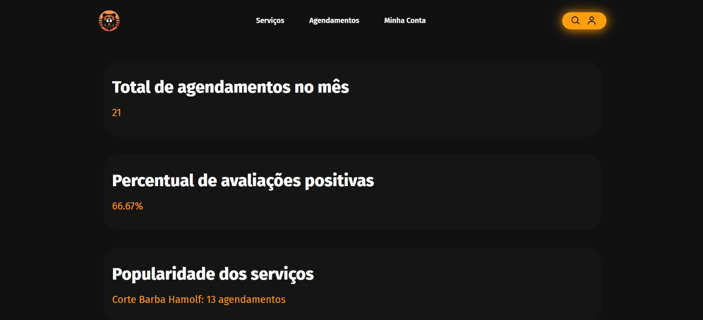
