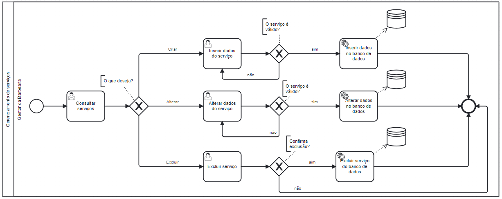

### 3.3.1 Processo 1 – Gerenciamento de serviços

O processo de gerenciamento de serviços no BarBear permite que os gestores da barbearia cadastrem, editem e excluam serviços, garantindo que a lista disponível para os clientes esteja sempre atualizada. O sistema reflete as mudanças em tempo real e notifica os clientes, facilitando a gestão interna e assegurando uma melhor experiência ao escolher e agendar serviços. Uma oportunidade de melhoria no gerenciamento de serviços do BarBear seria implementar um sistema de feedback automatizado para cada serviço concluído. Isso permitiria que os clientes avaliassem os serviços diretamente após a finalização, ajudando a barbearia a identificar áreas de aprimoramento e ajustar sua oferta com base nas preferências e necessidades dos clientes.

#### Detalhamento das atividades

**Consultar Serviços**

| **Campo**             | **Tipo**         | **Restrições** | **Valor default** |
| ---                   | ---              | ---            | ---               |
| NomeServico           | Caixa de Texto   | Não editável   |                   |
| DescricaoServico      | Caixa de Texto   | Não editável   |                   | 
| TipoServico           | Caixa de Texto   | Não editável   |                   |   
| Preco                 | Numérico         | Não editável   |                   |

| **Comandos**          |  **Destino**                       | **Tipo** |
| ---                   | ---                                | ---               |
| Alterar serviço       | Página de Alterar serviço          | Default           |
| Excluir serviço       | Página de Excluir serviços         | Default           |
| Cadastrar novo serviço| Página de Inserir dados do serviço | Default           |

**Inserir dados do serviço**

| **Campo**             | **Tipo**         | **Restrições** | **Valor default** |
| ---                   | ---              | ---            | ---               |
| NomeServico           | Caixa de Texto   |                |                   |
| DescricaoServico      | Caixa de Texto   |                |                   | 
| TipoServico           | Caixa de Texto   |                |                   |  
| Preco                 | Numérico         |                |                   |
| ImagemServico        | Caixa de Texto    |                |                   |

| **Comandos**         |  **Destino**                   | **Tipo**          |
| ---                  | ---                            | ---               |
| Cadastrar	           | Página de Consultar Serviços   | Default           |

**Alterar Dados do Serviço**

| **Campo**             | **Tipo**         | **Restrições** | **Valor default** |
| ---                   | ---              | ---            | ---               |
| NomeServico           | Caixa de Texto   |                |                   |
| DescricaoServico      | Caixa de Texto   |                |                   | 
| TipoServico           | Caixa de Texto   |                |                   |  
| PrecoServico          | Numérico         |                |                   |
| ImagemServico        | Caixa de Texto      |                |                   |

| **Comandos**         |  **Destino**                          | **Tipo**          |
| ---                  | ---                                   | ---               |
| Atualizar            | Página de Consultar Serviços          | Default           |                     

**Excluir serviço**

| **Campo**             | **Tipo**         | **Restrições** | **Valor default** |
| ---                   | ---              | ---            | ---               |
| NomeServico           | Caixa de Texto   | Não editável   |                   |
| DescricaoServico      | Caixa de Texto   | Não editável   |                   | 
| TipoServico           | Caixa de Texto   | Não editável   |                   |  
| PrecoServico          | Numérico         | Não editável   |                   |
| ImagemServico        | Caixa de Texto    | Não editável   |                   |

| **Comandos**          |  **Destino**                       | **Tipo** |
| ---                   | ---                                | ---               |
| Alterar serviço       | Página de Alterar serviço          | Default           |
| Excluir serviço       | Página de Excluir serviços         | Default           |
| Cadastrar novo serviço| Página de Inserir dados do serviço | Default           |

                      

