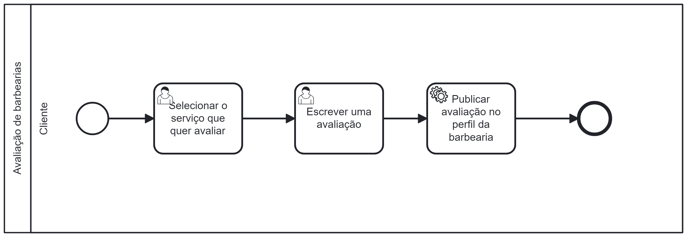

### 3.3.2 Processo 2 – Avaliação de Barbearias

O processo de avaliação de um estabelecimento é crucial para que ele possa se informar sobre a percepção dos clientes a seu respeito e identificar pontos a serem melhorados. Além disso, é um fator decisivo na escolha de um local para realizar determinado serviço por parte dos clientes.

Por isso, o BarBear oferece aos clientes a possibilidade de avaliar a barbearia onde realizaram um serviço, auxiliando outros clientes a obterem informações sobre ela e ajudando as barbearias a aprimorar seus serviços.

Para fazer uma avaliação, é necessário que o cliente tenha realizado um agendamento em uma barbearia cadastrada e concluído um serviço no local. Ao escrever a avaliação, ela ficará vinculada ao perfil da barbearia e será visível para outros usuários do sistema.

#### Detalhamento das atividades

**Selecionar o serviço que quer avaliar**

| **Campo**         | **Tipo**         | **Restrições**         | **Valor default** |
| ---               | ---              | ---                    | ---               |
| NomeServiço       | Caixa de texto   | Não editável           | ---               |
| DescricaoServico  | Caixa de texto    | Não editável           | ---               |
| Data              | Caixa de texto    | Não editável           | ---               |
| Horário           | Seleção única    | Não editável           | ---               |

| **Comandos**                |  **Destino**                   | **Tipo**          |
| ---                         | ---                            | ---               |
| Avaliar                     | Pop-up de avaliação do serviço | Default           |

**Escrever uma avaliação**

| **Campo**         | **Tipo**         | **Restrições**         | **Valor default** |
| ---               | ---              | ---                    | ---               |
| Descreva sobre    | Caixa de texto    | ---                    | ---               |
| Nota             | Seleção única    | ---                    | ---               |

| **Comandos**         |  **Destino**                   | **Tipo**          |
| ---                  | ---                            | ---               |
| Salvar               | Página de serviço selecionado  | Default           |
| Fechar               | Página de serviço selecionado   | Cancel            |
