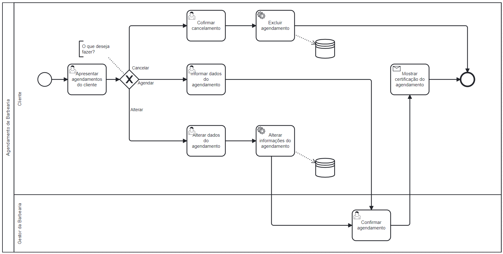

### 3.3.3 Processo 3 – Agendamento

O processo de agendamento de serviços na barbearia é crucial para garantir uma experiência organizada e eficaz tanto para o cliente quanto para o estabelecimento. Envolvendo a solicitação de um horário pelo cliente, a escolha de data e hora, e a verificação de disponibilidade. Se houver disponibilidade, o sistema confirma o agendamento, envia uma certificação ao cliente e notifica ambos (cliente e barbearia). Caso o horário não esteja disponível, o cliente pode escolher outro ou encerrar o processo.

Após a confirmação, o sistema notifica automaticamente as partes envolvidas e atualiza a disponibilidade de horários. Esse processo garante uma gestão eficiente dos horários e melhora a experiência tanto do cliente quanto da barbearia.

Uma oportunidade de melhoria seria enviar uma notificação relembrando o cliente de seu agendamento.

#### Detalhamento das atividades

**Apresentar agendamentos do cliente**

| **Campo**           | **Tipo**        | **Restrições** | **Valor default** |
| ---                 | ---             | ---            | ---               |
| Nome Serviço        | Caixa de Texto  | Não editável           | ---               |
| Nome Barbearia      | Caixa de Texto  | Não editável           | ---               |
| Data Agendamento     | Caixa de Texto  | Não editável           | ---               |
| Horario Agendamento  | Seleção única   | Não editável           | ---               |
| Descrição Agendamento| Caixa de Texto  | Não editável           | ---               |

| **Comandos**         |  **Destino**                      | **Tipo**  |
| ---                  | ---                               | ---       |
| Agendar novo serviço | Informar dados do agendamento     | default   |
| Alterar Agendamento  | Alterar dados do agendamento      | default   |
| Cancelar Agendamento | Exibir agendamentos               | default   |

**Confirmar cancelamento**

| **Campo**           | **Tipo**        | **Restrições** | **Valor default** |
| ---                 | ---             | ---            | ---               |
| Nome Serviço        | Caixa de Texto  | Não editável           | ---               |
| Nome Barbearia      | Caixa de Texto  | Não editável           | ---               |
| Data Agendamento     | Caixa de Texto  | Não editável           | ---               |
| Horario Agendamento  | Seleção única   | Não editável           | ---               |
| Descrição Agendamento| Caixa de Texto  | Não editável           | ---               |

| **Comandos**         |  **Destino**                      | **Tipo**  |
| ---                  | ---                               | ---       |
| Agendar novo serviço | Informar dados do agendamento     | default   |
| Alterar Agendamento  | Alterar dados do agendamento      | default   |
| Cancelar Agendamento | Exibir agendamentos               | default   |

**Informar dados do agendamento**

| **Campo**           |   **Tipo**        | **Restrições** | **Valor default** |
| ---                    | ---             | ---            | ---               |
| Nome do Serviço        | Caixa de Texto  |                | ---               |
| Descrição do Agendamento| Caixa de Texto  |               | ---               |
| Data                    | Caixa de Texto  |               | ---               |
| Horários Disponíveis    | Seleção única   |               | ---               |

| **Comandos**         |  **Destino**                     | **Tipo**  |
| ---                  | ---                              | ---       |
| Checkar Disponibilidade  | Página de informar dados do agendamento     | default   |

**Alterar dados do agendamento**

| **Campo**           |   **Tipo**        | **Restrições** | **Valor default** |
| ---                    | ---             | ---            | ---               |
| Nome do Serviço        | Caixa de Texto  |                | ---               |
| Descrição do Agendamento| Caixa de Texto  |               | ---               |
| Data                    | Caixa de Texto  |               | ---               |
| Horários Disponíveis    | Seleção única   |               | ---               |

| **Comandos**         |  **Destino**                     | **Tipo**  |
| ---                  | ---                              | ---       |
| Checkar Disponibilidade  | Página de informar dados do agendamento     | default   |

**Confirmar agendamento**

| **Campo**           | **Tipo**        | **Restrições** | **Valor default** |
| ---                 | ---             | ---            | ---               |
| Nome Serviço        | Caixa de Texto  | Não editável           | ---               |
| Data Agendamento     | Caixa de Texto  | Não editável           | ---               |
| Horario Agendamento  | Seleção única   | Não editável           | ---               |
| Descrição Agendamento| Caixa de Texto  | Não editável           | ---               |

| **Comandos**         |  **Destino**                              | **Tipo**  |
| ---                  | ---                                       | ---       |
| Confirmar            | Apresentar agendamentos                   | default   |
| Cancelar             | Apresentar agendamentos                   | cancel    |
