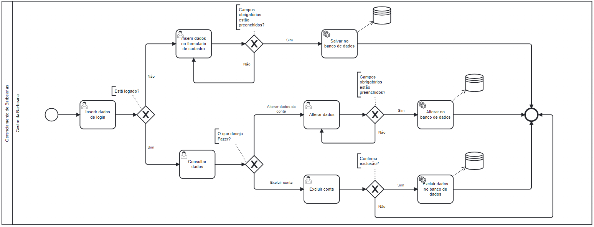

### 3.3.4 Processo 4 – Gerenciamento de Barbearias

O processo de negócio "Cadastro de Barbearias" envolve a inserção de novos estabelecimentos no BarBear. O gestor da barbearia acessa o sistema, preenche os dados básicos do estabelecimento, como nome, endereço, serviços oferecidos e horários de funcionamento. Após a verificação e validação das informações fornecidas, a barbearia passa a ser listada no aplicativo, permitindo que os clientes agendem serviços de forma online. Esse processo garante que as informações das barbearias estejam sempre atualizadas e disponíveis para os usuários.

#### Detalhamento das atividades

**Inserir dados de login**

| **Campo**       | **Tipo**         | **Restrições**          | **Valor default** |
| ---             | ---              | ---                     | ---               |
| Email  | Caixa de Texto   |                         |                   |
| Senha  | Caixa de Texto   |                         |                   |
| ClienteOuBarbearia | Seleção única   |                         |                   |

| **Comandos**         |  **Destino**                   | **Tipo** |
| ---                  | ---                            | ---      |
| Logar               | Página do perfil do usuário     | Default  |

**Consultar Dados**

| **Campo**        | **Tipo**         |   **Restrições**   | **Valor default** |
| ---              | ---              | ---                | ---               |
| Nome da Barbearia | Caixa de texto   | Não editável                   |                   |
| Cnpj             | Caixa de texto   | Não editável                   |                   |
| Email           | Caixa de texto   | Não editável                   |                   |
| Telefone        | Caixa de texto   | Não editável                   |                   |
| CEP              | Caixa de texto   | Não editável                   |                   |
| Rua              | Caixa de texto   | Não editável                   |                   |
| Bairro           | Caixa de texto   | Não editável                   |                   |

| **Comandos**                     |  **Destino**                                | **Tipo** |
| ---                              | ---                                        | ---        |
| Alterar dados cadastrados        | Página de Alterar dados da barbearia       |            |
| Deseja fazer a exclusão da conta?| Página de Excluir conta da barbearia        |            |
| Deseja ver seus serviços?        | Página de Listagem de Serviços da barbearia |            |
| Verificar desempenho da barbearia| Página dos indicadores de desempenho         |             |
| Verificar o agrado dos clientes  | Página de Minhas avaliações                  |             |
| Confirmar seus agendamentos      | Página dos agendamentos da barbearia         |             |
| Sair da conta                    | Página inicial do site                       |              |

**Inserir dados no formulário de cadastro**

| **Campo**        | **Tipo**         |   **Restrições**   | **Valor default** |
| ---              | ---              | ---                | ---               |
| Nome da Barbearia    | Caixa de texto   |                    |                   |
| Cnpj         | Caixa de texto   |                    |                   |
| Email        | Caixa de texto   |                    |                   |
| Telefone     | Caixa de texto   |                    |                   |
| Horario     |  Checkboxes        |   Seleção obrigatória                  |                   |
| Senha        | Caixa de Texto   |                    |                   |
| CEP        | Caixa de Texto   |                    |                   |
| Rua        | Caixa de Texto   |                    |                   |
| Bairro        | Caixa de Texto   |                    |                   |

| **Comandos**     |  **Destino**                   | **Tipo**    |
| ---              | ---                            | ---         |
| Finalizar      | Página do perfil do usuário    |          |

**Alterar dados**

| **Campo**            | **Tipo**         |   **Restrições**   | **Valor default** |
| ---                  | ---              | ---                | ---               |
| Nome da Barbearia    | Caixa de texto  |                    |                   |
| Cnpj                 | Caixa de texto   |                     |                   |
| Email                | Caixa de texto   |                   |                   |
| Telefone             | Caixa de texto   |                    |                   |
| Senha                | Caixa de Texto   |                    |                   |
| CEP                  | Caixa de Texto   |                    |                   |
| Rua                  | Caixa de Texto   |                    |                   |
| Bairro               | Caixa de Texto   |                    |                   |

| **Comandos**     |  **Destino**                   | **Tipo**    |
| ---              | ---                            | ---         |
| Finalizar    | Página do perfil do usuário        |          |

**Excluir conta**

| **Campo**              | **Tipo**         | **Restrições**         | **Valor default** |
| ---                    | ---              | ---                    | ---               |
| ConfirmarSenha       | Caixa de Texto   |                        |                   |

| **Comandos**     |  **Destino**                   | **Tipo**    |
| ---              | ---                            | ---         |
| ConfirmarExclusão| Página inicial do site         | Default     |
