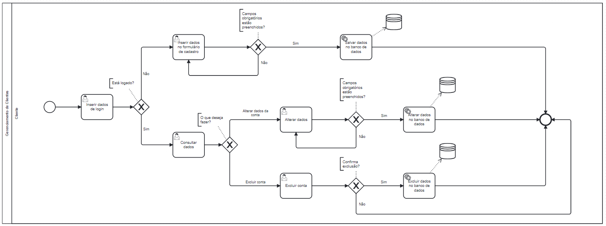

### 3.3.5 Processo 5 – Gerenciamento de Clientes

O processo de gerenciamento de clientes é muito importante para o funcionamento coerente do sistema, uma vez que com o controle das pessoas cadastradas é que será possível utilizar todas as funcionalidades, como a avaliação das barbearias e o agendamento de horários. 

Para isso, é necessário que o cliente cadastre seus dados por meio de um formulário digital. Esses dados serão validados pelo sistema. Assim, as atividades realizadas por ele ficarão vinculadas à sua conta.

Após já ter seu cadastro criado, o cliente poderá editar seus dados, se desejar, e também excluir sua conta.

#### Detalhamento das atividades

**Inserir dados de login**

| **Campo**       | **Tipo**         | **Restrições**          | **Valor default** |
| ---             | ---              | ---                     | ---               |
| Email           | Caixa de Texto   |                         |                   |
| Senha           | Caixa de Texto   |                         |                   |
| ClienteOuBarbearia | Seleção única  |                         |                   |

| **Comandos**         |  **Destino**                   | **Tipo** |
| ---                  | ---                            | ---      |
| Logar                | Página do perfil do usuário    | Default           |

**Consultar dados**

| **Campo**       | **Tipo**         | **Restrições**      | **Valor default** |
| ---             | ---              | ---                 | ---               |
| Email           | Caixa de Texto   | Não editável        |                   |
| Seu Nome        | Caixa de Texto   | Não editável        |                   |
| Telefone        | Caixa de Texto   | Não editável        |                   |

| **Comandos**               |  **Destino**                   | **Tipo** |
| ---                        | ---                            | ---               |
| Meus Agendamentos          | Página de Exibir agendamentos    |                   |
| Alterar dados cadastrados  | Página de Alterar dados do cliente |                   |
| Deseja fazer a exclusão da conta?| Página de excluir conta do cliente  |              |
| Sair da conta              | Página inicial                        |                |

**Inserir dados no formulário de cadastro**

| **Campo**       | **Tipo**         | **Restrições**    | **Valor default** |
| ---             | ---              | ---               | ---               |
| Nome      | Caixa de Texto   |                   |                   |
| Email   | Caixa de Texto   |                   |                   |
| Telefone | Caixa de Texto   |                   |                   |
| Senha    | Caixa de Texto   |                   |                   |

| **Comandos**     |  **Destino**                   | **Tipo**    |
| ---              | ---                            | ---         |
| Registre-se      | Página do perfil do usuário    | Default     |

**Alterar dados**

| **Campo**       | **Tipo**         | **Restrições**    | **Valor default** |
| ---             | ---              | ---               | ---               |
| Seu Nome   | Caixa de Texto   |                   |                   |
| Email   | Caixa de Texto   |                   |                   |
| Telefone | Caixa de Texto   |                   |                   |
| Senha  | Caixa de Texto   |                   |                   |

| **Comandos**     |  **Destino**                   | **Tipo**    |
| ---              | ---                            | ---         |
| Atualizar       | Página do perfil do usuário    | Default     |

**Excluir conta**

| **Campo**       | **Tipo**         | **Restrições**    | **Valor default** |
| ---             | ---              | ---               | ---               |
|ConfirmarSenha  | Caixa de Texto   |                   |                   |

| **Comandos**     |  **Destino**                   | **Tipo**    |
| ---              | ---                            | ---         |
| ConfirmarExclusao| Página inicial do site         | Default     |
